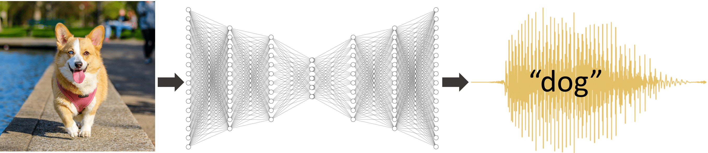

# Beyond Categorical Label Representations for Image Classification

[Boyuan Chen](http://boyuanchen.com/),
[Yu Li](https://www.linkedin.com/in/lilykat),
[Sunand Raghupathi](https://www.linkedin.com/in/sunand-raghupathi),
[Hod Lipson](https://www.hodlipson.com/)
<br>

bbbb
Columbia University
<br>
[International Conference on Learning Representations (ICLR 2021)](https://openreview.net/forum?id=MyHwDabUHZm)

### [Project Website](https://www.creativemachineslab.com/label-representation.html) | [Video](https://www.youtube.com/watch?v=Iq2YjHCAPRQ&t) | [Paper](https://openreview.net/forum?id=MyHwDabUHZm) | [Arxiv](https://arxiv.org/abs/2104.02226)

## Overview
This repo contains the PyTorch implementation for paper "Beyond Categorical Label Representations for Image Classification".
[](https://www.youtube.com/watch?v=Iq2YjHCAPRQ&t)

## Content

- [Installation](#installation)
- [Data Preparation](#data-preparation)
- [About the labels](#about-the-labels)
- [Training](#training)
- [Attacks](#attacks)
- [Training with Less Data](#training-with-less-data)
- [Shared Utilities](#shared-utilities)

## Installation

Create a python virtual environment and install the dependencies.

```bash
virtualenv -p /usr/bin/python3.6 env3.6
source env3.6/bin/activate
pip install -r requirements.txt
```

## Data Preparation

Download the CIFAR10 and CIFAR100 datasets by running:
```bash
mkdir ./data
cd ./data
wget https://www.cs.toronto.edu/\~kriz/cifar-10-python.tar.gz
wget https://www.cs.toronto.edu/\~kriz/cifar-100-python.tar.gz
cd ..
```

## About the labels
All labels are pre-generated in the labels folders and ready to be loaded directly for training. The notebook **labels/labels.ipynb** contains code for generating these labels.

Label types (```--label```):
- Category: **category**
- High-dimensional: **speech**, **uniform**, **shuffle**, **composite**, **bert**, and **random**
- Low-dimensional: **lowdim** and **glove**

Base model types (```--model```): **vgg19**, **resnet32**, and **resnet110**

Datasets (```--dataset```): **cifar10** and **cifar100** for cifar10 and cifar100

Seed (```--seed```): an int value for seeding data loading sequence

Data Level (```--level```): an int percentage (<90) for training with level% of all data (defaults to 100)

Base directory (```--base_dir```): location to save training/attacking results (required)

Label directory (```--label_dir```): location where label files are located (defaults to ```./labels/label_files```)

The **labels/label_files** folder contains the labels stored in .npy files.

* cifar10 high-dim labels:
* shape (10, 64, 64)
* dtype float32

* cifar100 high-dim labels:
* shape (100, 64, 64)
* dtype float32

You can find the original audio used to generate the speech labels in **labels/cifar10_wav/** and **labels/cifar100_wav/**. You can view the grayscale images of all composite labels (rescaled to 0-255) in **labels/composite/**.

## Training

Now to train the models use the following.
- Category: use **train.py** and specify label ```--label category```
```bash
python3 train.py --model resnet110 --dataset cifar10 --seed 7 --label category
```

- High-dimensional: use **train.py** and specify a particular high-dimensional label
```bash
python3 train.py --model vgg19 --dataset cifar100 --seed 77 --label speech
```
## Attacks
Run both targeted and untargeted FGSM and iterative attacks against trained models.
- Category: use **attack.py**
```bash
python3 attack.py --model resnet110 --dataset cifar10 --seed 7 --label category
```
- High-dimensional: use **attack.py** and specify a particular high-dimensional label
```bash
python3 attack.py --label speech --model vgg19 --dataset cifar100 --seed 77
```

## Training with Less Data
Use the same training files as before, but specify a data level.

- Category: use **train.py** to train with 2% data
```bash
python3 train.py --model resnet110 --dataset cifar10 --seed 7 --label category --level 2
```

- High-dimensional: use **train.py** to train with 8% data
```bash
python3 train.py --model vgg19 --dataset cifar100 --seed 77 --label speech --level 8
```

## Shared Utilities
- **architecture.py**: where the category and high-dimensional models are defined
- **cifar.py**: for loading cifar10 and cifar100 dataset for all label types
- **utils/trainutil.py**: other training helpers

## BibTex

```
@inproceedings{chen2021beyond,
  title={Beyond Categorical Label Representations for Image Classification},
  author={Chen, Boyuan and Li, Yu and Raghupathi, Sunand and Lipson, Hod},
  booktitle={The International Conference on Learning Representations},
  year={2021}
}
```

## License

This repository is released under the MIT license. See [LICENSE](LICENSE) for additional details.
